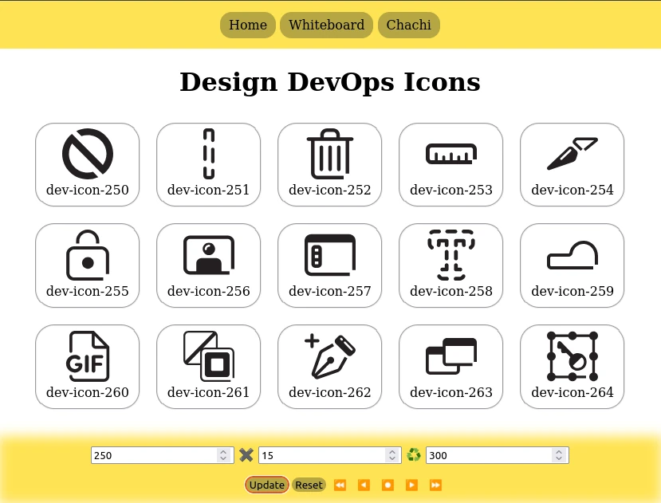
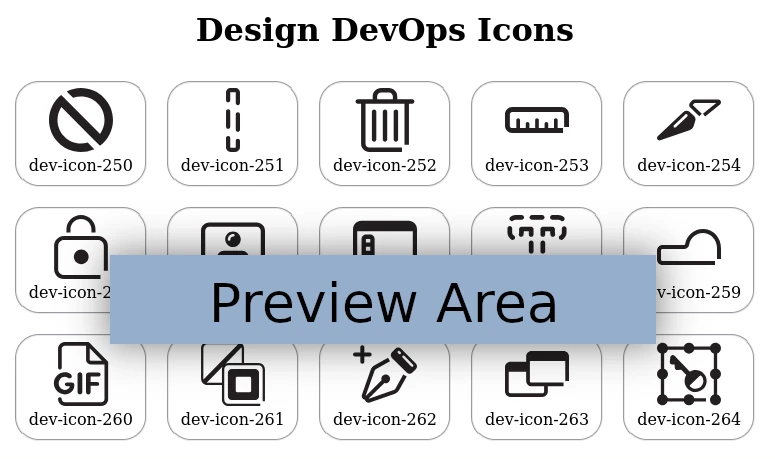
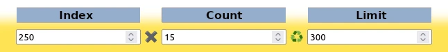

----------------------------------------------------------------

> <em>Help Manual</em>

----------------------------------------------------------------

# Page Layout

The __page__ typically appears similar to the figure below.

<figure center>
  
</figure>

----------------------------------------------------------------

## Navigation Menu

This menu is a collection of _anchor_ ( `A` ) elements.

It's located in the `HEADER` element pinned along the top of
the _page_.

<figure center>
  
</figure>

----------------------------------------------------------------

## Preview Area

The largest area is reserved for __previewing icons__.

The area is sandwiched between 
the __Navigation Menu__ ( `HEADER` ) and the
__Options Section__ ( `FOOTER` ).

<figure center>
  
</figure>

----------------------------------------------------------------

## Options Section

This section is dedicated to managing __input values__.

It's located within the `FOOTER` element pinned at the bottom of
the _page_, above the __Action Menu__.

<figure center>
  
</figure>

As shown above, there are _three_ __numeric input__ fields:

- __Index__
- __Count__
- __Limit__

----------------------------------------------------------------

__NOTE__: The _labels_ are shown here for __clarity__. They're 
<u>not</u> displayed on the actual _page_.

----------------------------------------------------------------

## Index Option

This input determines the __Index__ of the _first_ icon to be 
shown within the __Preview Area__.

The __Range__ is clamped so that it falls within
a _lower limit_ of `1` and
an _upper limit_ defined by
the __Limit__ input.

You can change this value _manually_. It's also updated for you
when you use the __Media Buttons__ for scrolling.

----------------------------------------------------------------

## Count Option

This input determines the __Number__ of icons to be displayed 
at any given location within the index __Range__.

We use a __Sliding Window__ of indices. This value represents
the __Size__ of that window.

----------------------------------------------------------------

## Limit Option

This input is meant primarily for _debugging_ and _development_.

However, it's also useful if the __number of icon__ files is
altered for some reason. Perhaps __new icons__ were uploaded
without reflecting this change in the Application's logic.

----------------------------------------------------------------

## Action Menu

This section is dedicated to managing __command actions__.

It's located within the `FOOTER` element pinned at the bottom of
the _page_, below the __Options Section__.

<figure center>
  
</figure>

### Update Button

The __Update__ button reads all _input values_ and performs
_validation_.

These new values are used to modify the icons shown in
the __Preview Area__.

<figure center>
  
</figure>

### Reset Button

The __Reset__ button restores all _input values_ to their
original states.

The __Preview Area__ is updated accordingly.

<figure center>
  
</figure>

----------------------------------------------------------------

## Media Buttons

These should be familiar, as they're used for 
most __Media Control__ applications.

<figure center>
  
</figure>

### Button Meanings

<!--
| Button  | Action Taken |
|---------|---------------------------|
|   ⏪    | Move to Previous Page     |
|   ◀️    | Move to Previous Column   |
|   ⏺️   | Rewind to Beginning       |
|   ▶️    | Move to Next Column       |
|   ⏩    | Move to Next Page         |
-->

<table>
<thead>
<tr><th>Button</th><th>Action Taken</th></tr>
</thead>
<tbody>
<tr><td>⏪</td><td>Move to Previous Page</td></tr>
<tr><td>◀️</td><td>Move to Previous Column</td></tr>
<tr><td>⏺️</td><td>Rewind to Beginning</td></tr>
<tr><td>▶️</td><td>Move to Next Column</td></tr>
<tr><td>⏩</td><td>Move to Next Page</td></tr>
</tbody>
</table>

----------------------------------------------------------------

# Icon Preview

----------------------------------------------------------------

- (pending)

----------------------------------------------------------------

# Embedding Source Code

----------------------------------------------------------------

- (pending)

----------------------------------------------------------------

# Example

----------------------------------------------------------------

- (pending)

----------------------------------------------------------------

# Page Layout

----------------------------------------------------------------

- (pending)

----------------------------------------------------------------

> <em>Handy Links</em>

----------------------------------------------------------------

[home]: 
<https://nyteowldave.github.io/>

[dev-icons]: 
<https://nyteowldave.github.io/dev-icons/>

[examples]: 
<https://nyteowldave.github.io/dev-icons/examples/>

[usage]: 
<https://nyteowldave.github.io/dev-icons/examples/usage.html>

[members]: 
<https://nyteowldave.github.io/dev-icons/help/members.html>

1. [Examples][examples]
2. [Icon Usage][usage]
3. [Legends Roll Call][members]
4. [Design Icons][dev-icons]
5. [Home][home]

----------------------------------------------------------------

<header>Design Icons</header>

<footer>
  
[ PENDING  ]

</footer>

----------------------------------------------------------------

