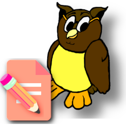

<head> <link rel="icon" href="./icons/mynotepad.png" /> </head>

<!-- ~~~~~~~~~~~~~~~~~~~~~~~~~~~~~~~~~~~~~~~~~~~~~~~~~~~~~~~ -->

[daves-notes]: <http://tiny.cc/daves-notes>
[tilly]: <https://sites.google.com/view/net-4-tilly/home>
[tigg]: <https://nyteowldave.github.io/tigg/>
[raindrop]: <https://app.raindrop.io/>
[basic]: <https://www.facebook.com/groups/2057165187928233>
[youtube]: <https://www.youtube.com/@TEK-Vectors>
[mdn]: <https://developer.mozilla.org/en-US/docs/Web/API>
[jsinfo]: <https://javascript.info/>
[json-editor]: <https://jsoneditoronline.org/>
[excalidraw]: <https://excalidraw.com/>
[kindle]: <https://read.amazon.com/kindle-library>

<!-- ~~~~~~~~~~~~~~~~~~~~~~~~~~~~~~~~~~~~~~~~~~~~~~~~~~~~~~~ -->

[me-omega]:
<http://dave-omega/app/morpheus/notes/mynotepad.html>
"Omega Edition"

[me-tower]:
<http://dave-tower/app/morpheus/notes/mynotepad.html>
"Tower Edition"

[me-legacy]:
<http://dave-legacy/app/morpheus/notes/mynotepad.html>
"Legacy Edition"

[me-morpheus]:
<https://nyteowldave.github.io/notes/mynotepad.html>
"Morpheus Edition"

----------------------------------------------------------------

  

----------------------------------------------------------------

# [`📝` My Notepad Notes][daves-notes]

----------------------------------------------------------------

> ( Morpheus Edition )

----------------------------------------------------------------

> [`🌐` Morpheus][me-morpheus]

### ( Private Access `📛` Only )

> [`🖥️` Omega][me-omega]
> [`🖥️` Tower][me-tower]
> [`🖥️` Legacy][me-legacy]
> [`🗃️` File System](./)

----------------------------------------------------------------

# `👥` Member Summary

> ( `MyNotepad Accessor` )

----------------------------------------------------------------

## `👤` Properties

| Member      | Description                                    |
|-------------|------------------------------------------------|
| bug_fixes   | Bugs Fixed in Morpheus Edition                 |
| cdn         | Content Delivery Network Addresses             |
| latest      | Host for Latest Changes                        |
| notes       | Notes Dictionary Object                        |
| storekey    | Notes Store Key / Filename                     |

----------------------------------------------------------------

## `👤` Methods

| Member      | Description                                    |
|-------------|------------------------------------------------|
| assist      | Show Members in Console                        |
| clone       | Clone Notes Object                             |
| dir         | Obtain Filtered List of Note Key Names         |
| entries     | Obtain Core Table of Note Entries              |
| entry       | Object Core Record for Note Entry (indexed)    |
| filter      | Filter String List Members                     |
| indexOf     | Obtain Index of Note Entry                     |
| inspect     | Show Notes Table in Console                    |
| key         | Obtain Key for Note Entry (indexed)            |
| manual      | Visit the Official User's Manual               |
| members     | Obtain Filtered List of Member Names           |
| merge       | Merge Source Object with Notes Object          |
| persist     | Write Notes Object to Store                    |
| persistable | Verify Browser Store is Available              |
| read        | Read Value for Note Entry                      |
| recover     | Read Notes Object from Store                   |
| recoverable | Verify Store Entry Exists                      |
| remove      | Remove Note Entry                              |
| rename      | Rename Note Entry                              |
| stats       | Obtain Statistics                              |
| summarize   | Obtain Member Summary Object                   |
| value       | Obtain Value for Note Entry (indexed)          |
| write       | Write Notes Object to Store                    |

----------------------------------------------------------------

# `📄` Source Files

- [`📄` my-notepad-v1p0.js](./../std/api/gems/my-notepad-v1p0.js)
- [`📄` prolog-beta.js](./../std/api/gems/prolog-beta.js)

----------------------------------------------------------------

# `🛠️` Client Apps

- [`🦇` TiGG][tigg]

----------------------------------------------------------------

# `📜` Modules

<section id="modules-section">

  <h3>📜 Embedded </h3>
  <select id="embedded_module_droplist"></select>
  🔍

  <h3>📜 Imported </h3>
  <select id="imported_module_droplist"></select>
  🔍

</section>

----------------------------------------------------------------

# [`💧` References][raindrop]

> [`💧` Decore](./mynotepad-decore.html)
> [`💧` Dave's Notes][daves-notes]
> [`💧` Sites](https://sites.google.com)
> [`💧` Cloud](https://dropbox.com)
> [`💧` Short URLs](https://tiny.cc)

> [`💧` Idea Flip](https://ideaflip.com/)
> [`💧` Tick Tock](https://ticktick.com/webapp/)
> [`💧` Markdown Editor](https://markdowneditor.org/)
> [`💧` Clipboard](https://live-clipboard.netlify.app/)
> [`💧` P5 Editor](https://editor.p5js.org/nyteowldave64/sketches)

> [`💧` BASIC Programming][basic]
> [`💧` JSON Editor][json-editor]
> [`💧` JS Info][jsinfo]
> [`💧` MDN][mdn]
> [`💧` Kindle][kindle]

> [`💧` Excalidraw][excalidraw]
> [`💧` YouTube][youtube]

----------------------------------------------------------------

# [`📡` Home Network][tilly]

### ( Private Access `📛` Only )

----------------------------------------------------------------

[liz]:     <http://dave-omega/demo/web/lissajous/lissajous.html>
[snek]:    <http://dave-legacy/app/hysteresis/pen.html>
[venus]:   <http://dave-omega/app/jarvis/toolkit/ncs/venus/>
[sknm]:    <http://dave-tower/jefr/sknm/sknm.html>
[demos]:   <http://dave-tower/demo/demo-menu.html>
[jarvis]:  <http://dave-tower/app/jarvis/jarvis-menu.html>
[jed]:     <http://dave-omega/app/jarvis/toolkit/ncs/venus/json-tree-editor.html>
[jefr]:    <http://dave-legacy/jefr/menu/mysql.html>
[sinkro]:  <http://dave-omega/app/sinkro/>
[locutus]: <http://dave-legacy/app/locutus/locutus.html>
[dorothy]: <http://dave-omega/demo/web/dorothy-rockets.html>
[desiree]: <http://dave-omega/app/jarvis/toolkit/ncs/desiree/des-ii.html>
[shirley]: <http://dave-omega/app/sinkro/notes/rt/shirley.html>
[caspar]:  <http://dave-omega/app/jarvis/toolkit/ncs/caspar/caspar.html>
[mjax]:    <http://dave-legacy/math/latex/mathjax.html>

> [`♒` Lissajous][liz]
> [`🛠️` Snek][snek]
> [`🛠️` Venus][venus]
> [`🛠️` Store Key Notes][sknm]
> [`🛠️` Math Jax][mjax]
> [`🛠️` Demos][demos]

> [`🛠️` Jarvis][jarvis]
> [`🛠️` Jeddak][jed]
> [`🛠️` Jefr][jefr]
> [`🛠️` SinKro][sinkro]
> [`🛠️` Locutus][locutus]

> [`🛠️` Dorothy][dorothy]
> [`🛠️` Desiree][desiree]
> [`🛠️` Shirley][shirley]
> [`🛠️` Caspar][caspar]

----------------------------------------------------------------

# `🧝` Usage Notes

- ( `pending` )

----------------------------------------------------------------

# `🧑‍💻` Improve `My Notepad`

- Add `HUD Editor`
- Import `HUD Editor` to `Morpheus`
- Finish `Usage Notes` Section
- Create an `Examples` page
- Locate More `Client Apps` (there are several others)
- Persistent Autoload Tables (JSON, CSV, HTML)
- Toggle Edit Mode for Tables (click header)

----------------------------------------------------------------

<!-- [[ NEEDS : header-footer.js ]] -->
<header id="header"></header>
<footer id="footer"></footer>

----------------------------------------------------------------

<!-- ~~~~~~~~~~~~~~~~~~~~~~~~~~~~~~~~~~~~~~~~~~~~~~~~~~~~~~~ -->

<!-- ~~~~~~~~~~~~~~~~~~~~~~~~~~~~~~~~~~~~~~~~~~~~~~~~~~~~~~~ -->

<!-- ~~~~~~~~~~~~~~~~~~~~~~~~~~~~~~~~~~~~~~~~~~~~~~~~~~~~~~~ -->

<!-- ~~~~~~~~~~~~~~~~~~~~~~~~~~~~~~~~~~~~~~~~~~~~~~~~~~~~~~~ -->

<!-- ~~~~~~~~~~~~~~~~~~~~~~~~~~~~~~~~~~~~~~~~~~~~~~~~~~~~~~~ -->

<!-- ~~~~~~~~~~~~~~~~~~~~~~~~~~~~~~~~~~~~~~~~~~~~~~~~~~~~~~~ -->

<!-- ~~~~~~~~~~~~~~~~~~~~~~~~~~~~~~~~~~~~~~~~~~~~~~~~~~~~~~~ -->

